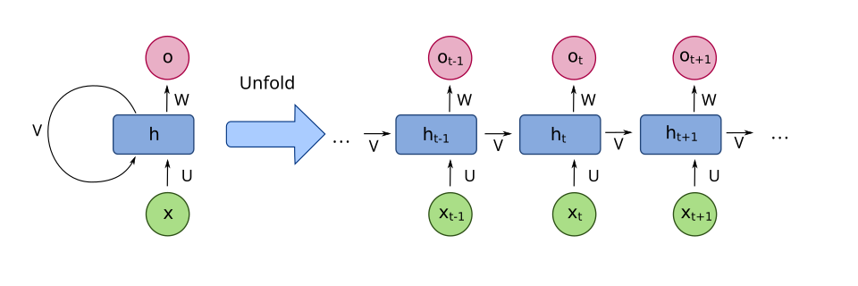
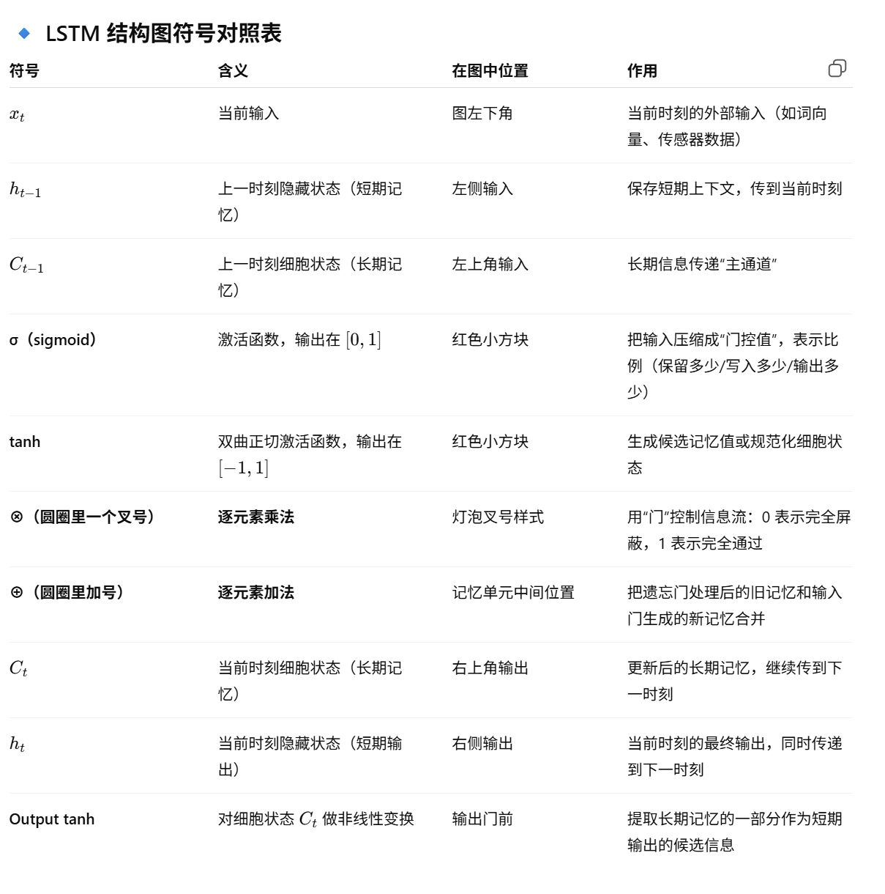
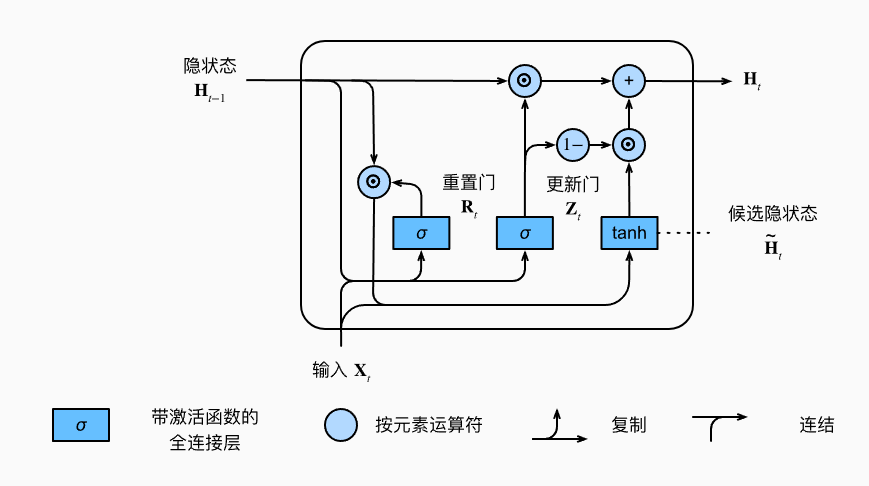
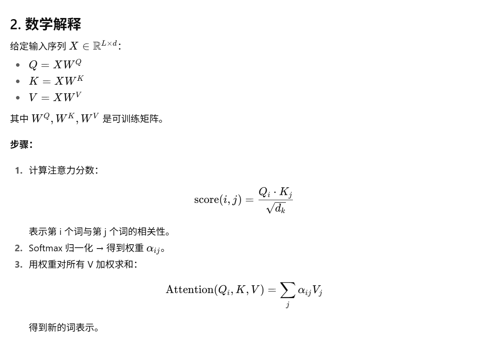

在[人工神经网络](https://en.wikipedia.org/wiki/Artificial_neural_networks)中， **循环神经网络** ( **RNN** ) 旨在处理序列数据，例如文本、语音和[时间序列 ](https://en.wikipedia.org/wiki/Time_series)[[ 1 \]](https://en.wikipedia.org/wiki/Recurrent_neural_network#cite_note-1) ，其中元素的顺序非常重要。与独立处理输入的[前馈神经网络](https://en.wikipedia.org/wiki/Feedforward_neural_network)不同，RNN 利用循环连接，其中一个神经元在一个时间步的输出会反馈到下一个时间步作为网络的输入。这使得 RNN 能够捕捉序列中的时间依赖关系和模式。

传统的循环神经网络 (RNN) 存在[梯度消失问题 ](https://en.wikipedia.org/wiki/Vanishing_gradient_problem)，这限制了它们学习长程依赖关系的能力。1997 年，[ 长短期记忆 ](https://en.wikipedia.org/wiki/Long_short-term_memory)(LSTM) 架构的出现解决了这个问题，使其成为处理长程依赖关系的标准 RNN 变体。后来，[ 门控循环单元 ](https://en.wikipedia.org/wiki/Gated_recurrent_unit)(GRU) 作为一种计算效率更高的替代方案被引入。


# RNN

好的 👍 我给你整理一个**RNN 的面试速背版总结**，简明又全面，适合直接在面试里复述。



------

# 🚀 RNN 简单总结

1. **全称**：Recurrent Neural Network，循环神经网络。

   - 用来处理 **序列数据**（文本、语音、时间序列）。
   - 特点：前一时刻的隐藏状态会传递给后一时刻，实现对上下文的记忆。

2. **核心结构**：

   - 每个时间步输入 xtx_t，结合前一时刻的隐藏状态 ht−1h_{t-1}，计算当前状态：

     ht=f(Whht−1+Wxxt+b)h_t = f(W_h h_{t-1} + W_x x_t + b)

   - 输出可以是序列（many-to-many，如翻译）或单值（many-to-one，如分类）。

3. **优点**：

   - 能够建模序列的时序依赖关系。
   - 结构简单，思想直观。

4. **缺点**：

   - **梯度消失/梯度爆炸**：在长序列中难以捕捉长期依赖。
   - **难以并行**：必须逐步计算，训练效率低。
   - 容量有限，表达能力受限。

5. **改进模型**：

   - **LSTM（长短期记忆）**：引入记忆单元和门机制。
   - **GRU（门控循环单元）**：简化版 LSTM，效率更高。

------

# 面试速答模板

*“RNN 是循环神经网络，用来处理序列数据。它的特点是把前一时刻的隐藏状态传递给下一时刻，从而建模上下文依赖。优点是适合处理时序任务，但缺点是存在梯度消失、难以并行，导致对长距离依赖建模能力差。后来出现了 LSTM 和 GRU 来改进这些问题，现在更多使用 Transformer 来替代。”*


---

# LSTM

好的 👍 我给你整理一个**LSTM 的面试速背版**，简洁明了，方便你在面试时快速复述。


> 
>
> ## 🔹 信息流小结
>
> - **σ（sigmoid）** → 负责“门控”，决定比例。
> - **tanh** → 负责“候选值/规范化”，保证数值范围稳定。
> - **⊗** → 用门控值去筛选信息（保留/丢弃）。
> - **⊕** → 把不同来源的信息合并（旧记忆 + 新信息）。
>
> ------
>
> ✅ **一句话总结**：
>
> - **σ** = 门控（保留多少）
> - **tanh** = 生成候选值（内容是什么）
> - **⊗** = 乘法门（比例控制信息）
> - **⊕** = 加法合并（旧记忆 + 新信息）


------

# 🚀 LSTM 简单介绍

1. **全称**：Long Short-Term Memory，长短期记忆网络。
   - 是 **RNN（循环神经网络）** 的改进版本。
   - 解决了 RNN 在长序列中 **梯度消失/梯度爆炸** 的问题。
2. **核心思想**：
   - 在隐藏层中引入一个 **记忆单元（cell state）**，用来长期存储信息。
   - 通过 **门机制（gates）** 控制信息的流动。
3. **三大门机制**：
   - **遗忘门（forget gate）**：决定丢掉多少旧信息。
   - **输入门（input gate）**：决定当前输入信息有多少写入记忆单元。
   - **输出门（output gate）**：决定从记忆单元输出多少信息。
4. **优点**：
   - 能捕捉 **长距离依赖**。
   - 缓解梯度消失问题。
   - 在序列建模任务（语音、翻译、时间序列预测）中表现优秀。
5. **缺点**：
   - 结构复杂，训练开销大。
   - 难以并行化（相较于 Transformer）。

------

# 面试速答模板

*“LSTM 是 RNN 的改进型，核心是通过引入记忆单元和门机制（遗忘门、输入门、输出门）来控制信息保留和丢弃，从而解决了 RNN 的梯度消失问题。它擅长处理长序列依赖，比如机器翻译、语音识别，但缺点是结构复杂、训练速度慢，后来逐渐被 Transformer 取代。”*


------


# GRU



------

# 🚀 GRU 简单总结

1. **全称**：Gated Recurrent Unit，门控循环单元。
   - 是 RNN 的改进版本，由 Cho 等人在 2014 年提出。
   - 设计目标：**简化 LSTM 结构**，同时解决 RNN 的梯度消失问题。
2. **核心思想**：
   - 通过 **门机制** 控制信息流动，决定哪些记忆保留，哪些丢弃。
   - 只保留两个门：
     - **更新门（update gate）**：决定保留多少旧信息、引入多少新信息。
     - **重置门（reset gate）**：决定遗忘多少历史信息，控制和当前输入的结合。
3. **与 LSTM 对比**：
   - LSTM 有 **三门 + 记忆单元**（输入、遗忘、输出 + cell state）。
   - GRU **两门合一，无显式记忆单元**，结构更简单，参数更少。
   - 效果相近，但 GRU 训练更快、资源占用更小。
4. **优点**：
   - 能建模长依赖关系。
   - 训练速度快，参数更少。
   - 在小数据集或计算资源有限时常优于 LSTM。
5. **缺点**：
   - 缺少单独的记忆单元（cell state），表达能力稍弱于 LSTM。
   - 在某些复杂任务上效果不如 LSTM 稳定。

------

# 面试速答模板

*“GRU 是门控循环单元，是对 RNN 的改进。它用更新门和重置门来控制信息流动，解决了梯度消失问题。相比 LSTM，GRU 结构更简单，没有单独的记忆单元，参数更少，训练更快。在很多任务上性能接近 LSTM，但在一些复杂任务中可能稍逊。”*


> - 工程常用版：`GRUClassifier`（基于 `nn.GRU`）、`LSTMClassifier`（基于 `nn.LSTM`），支持 `pack_padded_sequence` 与 `bidirectional`。
> - 教学版（手写时间步循环）：`SimpleGRUCellClassifier`（`nn.GRUCell`）、`SimpleLSTMCellClassifier`（`nn.LSTMCell`），逐步更新隐藏状态并用 mask 屏蔽 PAD。
>
> 如何切换：
>
> - 在代码 `main()` 里改 `hp.rnn_type` 为 `"rnn" | "gru" | "lstm"`。
> - 将 `hp.use_custom_cell = True` 可切到逐时间步教学实现；`False` 为工程高效实现。
> - 需要双向网络就把 `hp.bidirectional = True`（仅工程版支持）。
>
> 还要不要我加一个**语言建模（many-to-many）\**的小例子，或把三种网络的\**内部门控公式推导**也注释进去？

```python
"""
Minimal RNN/GRU/LSTM in PyTorch（含超详细中文注释）
=================================================
目标：
1) 从 0 到 1 跑通 **RNN / GRU / LSTM** 三种循环网络在一个序列分类任务（many-to-one）上的实现。
2) 同时展示两种实现路径：
   (A) 直接使用 `nn.RNN` / `nn.GRU` / `nn.LSTM`（工程常用）
   (B) 使用 `nn.RNNCell` / `nn.GRUCell` / `nn.LSTMCell` 手写时间步循环（帮助理解内部计算与隐藏状态管理）
3) 覆盖：Embedding、可变长序列 padding、`pack_padded_sequence`、取最后有效隐状态、训练/评估循环。

运行：
$ python Minimal_RNN_PyTorch_Chinese_Comments.py
（将下方文件保存为同名 .py 后运行；支持 CPU/GPU）

环境：PyTorch>=1.12（或 2.x）。
"""
from __future__ import annotations
import random
from dataclasses import dataclass
from typing import List, Tuple

import torch
import torch.nn as nn
import torch.nn.functional as F
from torch.utils.data import Dataset, DataLoader
from torch.nn.utils.rnn import pad_sequence, pack_padded_sequence

# ===============================
# 0) 随机种子，便于复现
# ===============================
def set_seed(seed: int = 42):
    random.seed(seed)
    torch.manual_seed(seed)
    torch.cuda.manual_seed_all(seed)

set_seed(42)

# ===============================
# 1) 人工数据集：
#    - 词表：整数 token（2..V-1），0 用作 PAD（1 可预留作特殊符号）。
#    - 每个样本是一段可变长序列，标签为“序列中 token 之和的奇偶性”（sum%2）。
#      这是一个玩具二分类问题，用来演示 RNN/GRU/LSTM 的完整训练流程。
# ===============================
class ToyVarLenParityDataset(Dataset):
    def __init__(self, num_samples: int, vocab_size: int = 100, min_len: int = 4, max_len: int = 20):
        self.vocab_size = vocab_size
        self.samples: List[Tuple[torch.LongTensor, int]] = []
        for _ in range(num_samples):
            L = random.randint(min_len, max_len)
            # 取值范围避开 0（PAD），此处 2..(vocab_size-1)
            seq = torch.randint(low=2, high=vocab_size, size=(L,), dtype=torch.long)
            label = int(seq.sum().item() % 2)  # 0 偶数，1 奇数
            self.samples.append((seq, label))

    def __len__(self):
        return len(self.samples)

    def __getitem__(self, idx):
        return self.samples[idx]

# ===============================
# 2) collate_fn：
#    - 将一个 batch 的可变长序列对齐（右侧 padding）；
#    - 记录每个序列的真实长度（用于 pack）。
#    - 返回：padded_seqs [B, L_max]，lengths [B]，labels [B]
# ===============================
PAD_ID = 0

def collate_varlen(batch: List[Tuple[torch.LongTensor, int]]):
    seqs, labels = zip(*batch)  # seqs: Tuple[Tensor(L_i)], labels: Tuple[int]
    lengths = torch.tensor([len(s) for s in seqs], dtype=torch.long)
    # 右侧 padding；注意 batch_first=True 时，期望 [B, L]
    padded = pad_sequence(seqs, batch_first=True, padding_value=PAD_ID)
    labels = torch.tensor(labels, dtype=torch.long)
    return padded, lengths, labels

# ===============================
# 3) 三种网络的“模块化分类器”（工程常用版本）
#    共同点：Embedding -> RNN/GRU/LSTM(Packed) -> 取最后层的最后隐状态 -> Linear
#    区别：
#       - RNN/GRU 返回 (output, h_n)
#       - LSTM 返回 (output, (h_n, c_n))，其中 h_n 是我们要用的“隐状态”
#    双向时（bidirectional=True），需要拼接同一层的正向/反向两个方向的 h_n。
# ===============================
class RNNClassifier(nn.Module):
    def __init__(self, vocab_size: int, emb_dim: int = 64, hidden_size: int = 128, num_layers: int = 1, bidirectional: bool = False):
        super().__init__()
        self.emb = nn.Embedding(vocab_size, emb_dim, padding_idx=PAD_ID)
        self.rnn = nn.RNN(
            input_size=emb_dim,
            hidden_size=hidden_size,
            num_layers=num_layers,
            nonlinearity='tanh',  # 可选 'relu'
            batch_first=True,
            bidirectional=bidirectional,
        )
        self.bidirectional = bidirectional
        out_dim = hidden_size * (2 if bidirectional else 1)
        self.fc = nn.Linear(out_dim, 2)  # 二分类

    def forward(self, input_ids: torch.LongTensor, lengths: torch.LongTensor):
        x = self.emb(input_ids)  # [B, L, E]
        packed = pack_padded_sequence(x, lengths.cpu(), batch_first=True, enforce_sorted=False)
        _, h_n = self.rnn(packed)  # h_n: [num_layers*num_directions, B, H]
        if self.bidirectional:
            last_fwd = h_n[-2, :, :]  # [B, H]
            last_bwd = h_n[-1, :, :]  # [B, H]
            h = torch.cat([last_fwd, last_bwd], dim=-1)  # [B, 2H]
        else:
            h = h_n[-1, :, :]  # [B, H]
        logits = self.fc(h)
        return logits

class GRUClassifier(nn.Module):
    def __init__(self, vocab_size: int, emb_dim: int = 64, hidden_size: int = 128, num_layers: int = 1, bidirectional: bool = False):
        super().__init__()
        self.emb = nn.Embedding(vocab_size, emb_dim, padding_idx=PAD_ID)
        self.gru = nn.GRU(
            input_size=emb_dim,
            hidden_size=hidden_size,
            num_layers=num_layers,
            batch_first=True,
            bidirectional=bidirectional,
        )
        self.bidirectional = bidirectional
        out_dim = hidden_size * (2 if bidirectional else 1)
        self.fc = nn.Linear(out_dim, 2)

    def forward(self, input_ids: torch.LongTensor, lengths: torch.LongTensor):
        x = self.emb(input_ids)
        packed = pack_padded_sequence(x, lengths.cpu(), batch_first=True, enforce_sorted=False)
        _, h_n = self.gru(packed)  # [num_layers*num_directions, B, H]
        if self.bidirectional:
            h = torch.cat([h_n[-2], h_n[-1]], dim=-1)  # [B, 2H]
        else:
            h = h_n[-1]
        logits = self.fc(h)
        return logits

class LSTMClassifier(nn.Module):
    def __init__(self, vocab_size: int, emb_dim: int = 64, hidden_size: int = 128, num_layers: int = 1, bidirectional: bool = False):
        super().__init__()
        self.emb = nn.Embedding(vocab_size, emb_dim, padding_idx=PAD_ID)
        self.lstm = nn.LSTM(
            input_size=emb_dim,
            hidden_size=hidden_size,
            num_layers=num_layers,
            batch_first=True,
            bidirectional=bidirectional,
        )
        self.bidirectional = bidirectional
        out_dim = hidden_size * (2 if bidirectional else 1)
        self.fc = nn.Linear(out_dim, 2)

    def forward(self, input_ids: torch.LongTensor, lengths: torch.LongTensor):
        x = self.emb(input_ids)
        packed = pack_padded_sequence(x, lengths.cpu(), batch_first=True, enforce_sorted=False)
        _, (h_n, c_n) = self.lstm(packed)  # h_n/c_n: [num_layers*num_directions, B, H]
        if self.bidirectional:
            h = torch.cat([h_n[-2], h_n[-1]], dim=-1)
        else:
            h = h_n[-1]
        logits = self.fc(h)
        return logits

# ===============================
# 4) 手写时间步循环（教学版）：使用 *_Cell 单元逐步更新
#    说明：
#      - 这里用 PyTorch 自带的 nn.RNNCell/GRUCell/LSTMCell，逐时间步循环，
#        并配合 mask 保证超过真实长度的位置不再更新隐藏状态。
#      - 真实工程：建议优先用上面的模块化版本 + pack，效率更高。
# ===============================
class SimpleRNNCellClassifier(nn.Module):
    def __init__(self, vocab_size: int, emb_dim: int = 64, hidden_size: int = 128):
        super().__init__()
        self.emb = nn.Embedding(vocab_size, emb_dim, padding_idx=PAD_ID)
        self.cell = nn.RNNCell(emb_dim, hidden_size, nonlinearity='tanh')
        self.fc = nn.Linear(hidden_size, 2)

    def forward(self, input_ids: torch.LongTensor, lengths: torch.LongTensor):
        x = self.emb(input_ids)             # [B, L, E]
        B, L, E = x.shape
        H = self.cell.hidden_size
        h = x.new_zeros((B, H))            # h_0 = 0
        for t in range(L):
            x_t = x[:, t, :]                # [B, E]
            h_t = self.cell(x_t, h)         # [B, H]
            mask = (t < lengths).float().unsqueeze(-1)  # [B,1]
            h = h_t * mask + h * (1 - mask)            # 仅对有效样本更新
        logits = self.fc(h)
        return logits

class SimpleGRUCellClassifier(nn.Module):
    def __init__(self, vocab_size: int, emb_dim: int = 64, hidden_size: int = 128):
        super().__init__()
        self.emb = nn.Embedding(vocab_size, emb_dim, padding_idx=PAD_ID)
        self.cell = nn.GRUCell(emb_dim, hidden_size)
        self.fc = nn.Linear(hidden_size, 2)

    def forward(self, input_ids: torch.LongTensor, lengths: torch.LongTensor):
        x = self.emb(input_ids)
        B, L, _ = x.shape
        H = self.cell.hidden_size
        h = x.new_zeros((B, H))
        for t in range(L):
            h_t = self.cell(x[:, t, :], h)
            mask = (t < lengths).float().unsqueeze(-1)
            h = h_t * mask + h * (1 - mask)
        logits = self.fc(h)
        return logits

class SimpleLSTMCellClassifier(nn.Module):
    def __init__(self, vocab_size: int, emb_dim: int = 64, hidden_size: int = 128):
        super().__init__()
        self.emb = nn.Embedding(vocab_size, emb_dim, padding_idx=PAD_ID)
        self.cell = nn.LSTMCell(emb_dim, hidden_size)
        self.fc = nn.Linear(hidden_size, 2)

    def forward(self, input_ids: torch.LongTensor, lengths: torch.LongTensor):
        x = self.emb(input_ids)
        B, L, _ = x.shape
        H = self.cell.hidden_size
        h = x.new_zeros((B, H))  # 隐状态 h
        c = x.new_zeros((B, H))  # 记忆单元 c
        for t in range(L):
            h_t, c_t = self.cell(x[:, t, :], (h, c))
            mask = (t < lengths).float().unsqueeze(-1)
            h = h_t * mask + h * (1 - mask)
            c = c_t * mask + c * (1 - mask)
        logits = self.fc(h)
        return logits

# ===============================
# 5) 训练与评估流程（通用）
# ===============================
@dataclass
class HParams:
    vocab_size: int = 200
    emb_dim: int = 64
    hidden_size: int = 128
    batch_size: int = 32
    lr: float = 1e-3
    epochs: int = 3
    rnn_type: str = "rnn"         # 可选: "rnn" | "gru" | "lstm"
    use_custom_cell: bool = False  # False: 用模块化版本；True: 用 *_Cell 教学版
    bidirectional: bool = False    # 仅模块化版本支持


def train_loop(model: nn.Module, loader: DataLoader, optimizer: torch.optim.Optimizer, device: torch.device):
    model.train()
    total_loss, total_correct, total = 0.0, 0, 0
    for input_ids, lengths, labels in loader:
        input_ids = input_ids.to(device)
        lengths = lengths.to(device)
        labels = labels.to(device)

        logits = model(input_ids, lengths)   # [B,2]
        loss = F.cross_entropy(logits, labels)

        optimizer.zero_grad()
        loss.backward()
        torch.nn.utils.clip_grad_norm_(model.parameters(), 1.0)  # 防止梯度爆炸
        optimizer.step()

        with torch.no_grad():
            pred = logits.argmax(dim=-1)
            total_correct += (pred == labels).sum().item()
            total += labels.size(0)
            total_loss += loss.item() * labels.size(0)
    return total_loss / total, total_correct / total


def eval_loop(model: nn.Module, loader: DataLoader, device: torch.device):
    model.eval()
    total_loss, total_correct, total = 0.0, 0, 0
    with torch.no_grad():
        for input_ids, lengths, labels in loader:
            input_ids = input_ids.to(device)
            lengths = lengths.to(device)
            labels = labels.to(device)
            logits = model(input_ids, lengths)
            loss = F.cross_entropy(logits, labels)
            pred = logits.argmax(dim=-1)
            total_correct += (pred == labels).sum().item()
            total += labels.size(0)
            total_loss += loss.item() * labels.size(0)
    return total_loss / total, total_correct / total

# ===============================
# 6) main：组装数据、模型、训练
# ===============================

def build_model(hp: HParams) -> nn.Module:
    if hp.use_custom_cell:
        # 教学版（逐时间步循环）
        if hp.rnn_type == "rnn":
            return SimpleRNNCellClassifier(hp.vocab_size, hp.emb_dim, hp.hidden_size)
        elif hp.rnn_type == "gru":
            return SimpleGRUCellClassifier(hp.vocab_size, hp.emb_dim, hp.hidden_size)
        elif hp.rnn_type == "lstm":
            return SimpleLSTMCellClassifier(hp.vocab_size, hp.emb_dim, hp.hidden_size)
        else:
            raise ValueError("rnn_type 只能是 rnn/gru/lstm")
    else:
        # 工程版（打包序列 + 高效计算）
        if hp.rnn_type == "rnn":
            return RNNClassifier(hp.vocab_size, hp.emb_dim, hp.hidden_size, num_layers=1, bidirectional=hp.bidirectional)
        elif hp.rnn_type == "gru":
            return GRUClassifier(hp.vocab_size, hp.emb_dim, hp.hidden_size, num_layers=1, bidirectional=hp.bidirectional)
        elif hp.rnn_type == "lstm":
            return LSTMClassifier(hp.vocab_size, hp.emb_dim, hp.hidden_size, num_layers=1, bidirectional=hp.bidirectional)
        else:
            raise ValueError("rnn_type 只能是 rnn/gru/lstm")


def main():
    device = torch.device('cuda' if torch.cuda.is_available() else 'cpu')
    hp = HParams()
    # ============ 根据需要在此修改 ============
    # hp.rnn_type = "gru"       # 切换为 GRU
    # hp.rnn_type = "lstm"      # 切换为 LSTM
    # hp.use_custom_cell = True  # 切换到 *_Cell 教学版实现
    # hp.bidirectional = True    # 仅模块化版本支持双向
    # =========================================

    # 数据：训练/验证
    train_ds = ToyVarLenParityDataset(num_samples=2000, vocab_size=hp.vocab_size)
    valid_ds = ToyVarLenParityDataset(num_samples=400, vocab_size=hp.vocab_size)
    train_loader = DataLoader(train_ds, batch_size=hp.batch_size, shuffle=True, collate_fn=collate_varlen)
    valid_loader = DataLoader(valid_ds, batch_size=hp.batch_size, shuffle=False, collate_fn=collate_varlen)

    # 构建模型
    model = build_model(hp).to(device)
    optimizer = torch.optim.AdamW(model.parameters(), lr=hp.lr)

    # 训练若干个 epoch
    for epoch in range(1, hp.epochs + 1):
        tr_loss, tr_acc = train_loop(model, train_loader, optimizer, device)
        va_loss, va_acc = eval_loop(model, valid_loader, device)
        print(f"Epoch {epoch:02d} | train loss {tr_loss:.4f} acc {tr_acc:.4f} | valid loss {va_loss:.4f} acc {va_acc:.4f}")

    # 演示：单条样本预测
    model.eval()
    with torch.no_grad():
        seq = torch.tensor([5, 7, 9, 4, 3, 8])  # 例子序列
        label = int(seq.sum().item() % 2)
        input_ids, lengths, _ = collate_varlen([(seq, label)])
        logits = model(input_ids.to(device), lengths.to(device))
        prob = logits.softmax(-1)[0]
        pred = prob.argmax().item()
        print(f"测试样本: {seq.tolist()} | 真值(奇偶)={label} | 预测={pred} | 概率={prob.cpu().tolist()}")


if __name__ == '__main__':
    main()

```


# Transformer


------

# 🚀Transformer 

**整体结构：Encoder–Decoder**

- **输入**：词向量 + 位置编码
- **Encoder**：堆叠 N 层（常见 6 层） → 每层包含
  1. **多头自注意力（Multi-Head Self-Attention）**：捕捉句子内部各词之间关系
  2. **前馈全连接网络（FFN）**：提升非线性表达能力
  3. **残差连接 + LayerNorm**：防止梯度消失，加快收敛
- **Decoder**：结构类似，但多了
  1. **Masked Self-Attention**：保证只看见历史信息
  2. **Encoder–Decoder Attention**：把编码器的信息引入解码器
- **输出**：通过 Softmax 得到预测结果（如下一个词概率分布）。

------

# 核心知识点总结

1. **自注意力机制（Self-Attention）**
   - 公式：`Attention(Q,K,V) = softmax(QK^T / √d_k) V`
   - 作用：衡量词与词的相关性。
2. **多头注意力（Multi-Head Attention）**
   - 多组 Q/K/V 并行计算，能关注不同语义关系。
3. **位置编码（Positional Encoding）**
   - 因为没有循环和卷积，所以用位置编码让模型知道词的顺序。
4. **前馈网络（FFN）**
   - 两层线性变换 + 激活函数（ReLU/GELU）。
5. **残差连接 + LayerNorm**
   - 稳定训练、提高梯度传播。
6. **三种常见架构**
   - **Encoder-only**（BERT）：理解任务（分类/检索）。
   - **Decoder-only**（GPT）：生成任务（对话/写作）。
   - **Encoder–Decoder**（原始 Transformer, T5）：序列到序列（翻译/摘要）。
7. **优势**
   - 并行训练 → 速度快。
   - 长依赖建模能力强。
   - 可扩展到多模态（图像/语音/跨模态）。

------

要是面试官问“Transformer 的基本原理”，你可以简短回答：
 👉 *“Transformer 用自注意力机制代替 RNN/CNN 建模序列关系，通过多头注意力捕捉不同语义，位置编码补充顺序信息，整个结构靠残差和归一化保证稳定。Encoder 主要做理解，Decoder 主要做生成。”*


好问题 👌 这是面试里最常被追问的细节之一。下面我给你用**直白类比 + 数学解释**两种方式讲清楚 Q、K、V：

------

# 1. 直观理解（类比版）

- **Q (Query, 查询)**：我是谁，要去找相关信息。
- **K (Key, 键)**：我的特征标签，用来匹配别人。
- **V (Value, 值)**：我的实际内容，被取出来加权组合。

👉 类比：
 你在图书馆找书。

- 你的问题就是 **Q**。
- 每本书的标签（标题/分类号）就是 **K**。
- 书的内容就是 **V**。
   计算 Q 和 K 的相似度（相关性），再根据结果决定从哪些 V 拿多少内容。

------

# 2. 数学解释



------

# 3. 作用总结

- **Q**：决定“我要找什么信息”。
- **K**：决定“我能提供什么信息”。
- **V**：真正“提供的信息内容”。

------

如果面试官突然问：
 👉 **“Q、K、V 为什么要分开学，不直接用 X？”**
 你可以答：

- 不同的任务需要不同的表示空间，Q/K/V 投影让模型能学到**不同角度的特征**。
- 例如 Q/K 专注匹配关系，V 专注携带上下文信息。
- 分开还能增加模型表达能力。


```python
"""
Minimal Transformer (Encoder-Decoder) from scratch in PyTorch
=============================================================
目标（为配合面试/学习，加入**超详细中文注释**）：
1) 逐行对应抽象架构图（位置编码 → 多头注意力 → 前馈网络 → 残差/归一化 → 编解码堆叠）。
2) 显式标注**张量形状**和**mask 语义**（1=保留、0=遮挡），避免“脑补”。
3) 附带一个**可运行的极简 Demo**（toy copy task），观察前向/损失/一步训练，帮助理解数据流。

你可以运行：
$ python Minimal_Transformer_PyTorch.py

依赖：PyTorch >= 1.12（或 2.x）。CPU 也可运行。
"""
from __future__ import annotations
import math
from dataclasses import dataclass
from typing import Optional, Tuple

import torch
import torch.nn as nn
import torch.nn.functional as F

# ===================================================================
# 1) 位置编码（Positional Encoding, Sin/Cos）
# -------------------------------------------------------------------
# Transformer 不含循环/卷积，模型本身不知道“顺序”。
# 因此需要显式注入位置信息：最经典的是“正弦/余弦位置编码”。
# 特点：
# - 无参数；
# - 对不同长度可插值；
# - 高频/低频组合，能表达相对位置信息。
# ===================================================================
class PositionalEncoding(nn.Module):
    """正弦/余弦位置编码（与原论文一致）
    输入：嵌入后张量 x，形状 [B, L, d_model]
    输出：x 与位置编码逐元素相加后的张量（形状不变）
    """
    def __init__(self, d_model: int, max_len: int = 10000):
        super().__init__()
        # pe: [max_len, d_model]，为每个位置预先生成固定的编码
        pe = torch.zeros(max_len, d_model)
        # position: [max_len, 1]，位置索引 0..max_len-1
        position = torch.arange(0, max_len, dtype=torch.float).unsqueeze(1)
        # div_term：频率项，偶数维用 sin，奇数维用 cos
        div_term = torch.exp(torch.arange(0, d_model, 2).float() * (-math.log(10000.0) / d_model))
        pe[:, 0::2] = torch.sin(position * div_term)
        pe[:, 1::2] = torch.cos(position * div_term)
        pe = pe.unsqueeze(0)  # [1, max_len, d_model]，方便与批次广播相加
        # register_buffer 表示这不是可训练参数，但会随模型保存/加载
        self.register_buffer('pe', pe)

    def forward(self, x: torch.Tensor) -> torch.Tensor:
        # x: [B, L, d_model]
        L = x.size(1)
        # 截取前 L 个位置编码并相加
        return x + self.pe[:, :L, :]


# ===================================================================
# 2) 多头注意力（Multi-Head Attention, MHA）
# -------------------------------------------------------------------
# 核心公式：Attn(Q,K,V) = softmax(QK^T / sqrt(d_k)) V
# 直觉：用 Query 与 Key 的相似度（相关性）对 Value 做加权汇聚。
# 多头：将特征维切分为 h 个子空间并行计算，捕捉不同关系模式；最后拼接。
# 本实现：
# - 显式给出形状转换： [B, L, d] → [B, h, L, d_head]
# - attn_mask: 1=保留, 0=遮挡（兼容 padding mask / causal mask）
# ===================================================================
class MultiHeadAttention(nn.Module):
    def __init__(self, d_model: int, num_heads: int, dropout: float = 0.0):
        super().__init__()
        assert d_model % num_heads == 0, "d_model 必须能被 num_heads 整除"
        self.d_model = d_model
        self.num_heads = num_heads
        self.d_head = d_model // num_heads  # 每个头的维度

        # Q/K/V 的线性投影：分别学习不同的表示空间
        self.w_q = nn.Linear(d_model, d_model)
        self.w_k = nn.Linear(d_model, d_model)
        self.w_v = nn.Linear(d_model, d_model)
        # 头拼接后的输出投影
        self.w_o = nn.Linear(d_model, d_model)
        self.dropout = nn.Dropout(dropout)

    def forward(
        self,
        q: torch.Tensor,  # [B, L_q, d_model]
        k: torch.Tensor,  # [B, L_k, d_model]
        v: torch.Tensor,  # [B, L_k, d_model]
        attn_mask: Optional[torch.Tensor] = None,  # [B,1,L_q,L_k] 或 [1,1,L_q,L_k]，1=保留，0=遮挡
    ) -> Tuple[torch.Tensor, torch.Tensor]:
        B, L_q, _ = q.shape
        B, L_k, _ = k.shape

        # 2.1 线性映射到 Q/K/V 空间
        Q = self.w_q(q)  # [B, L_q, d_model]
        K = self.w_k(k)  # [B, L_k, d_model]
        V = self.w_v(v)  # [B, L_k, d_model]

        # 2.2 切分多头并调整维度顺序： [B, L, h, d_head] → [B, h, L, d_head]
        def split_heads(x):
            return x.view(B, -1, self.num_heads, self.d_head).transpose(1, 2)

        Q = split_heads(Q)  # [B, h, L_q, d_head]
        K = split_heads(K)  # [B, h, L_k, d_head]
        V = split_heads(V)  # [B, h, L_k, d_head]

        # 2.3 计算缩放点积注意力分数： [B,h,L_q,L_k]
        scores = Q @ K.transpose(-2, -1) / math.sqrt(self.d_head)
        # 掩码：将不允许的位置置为 -inf，使 softmax 后概率为 0
        if attn_mask is not None:
            scores = scores.masked_fill(attn_mask == 0, float('-inf'))
        attn = F.softmax(scores, dim=-1)  # 注意力权重
        attn = self.dropout(attn)

        # 2.4 加权求和得到上下文，合并多头
        context = attn @ V  # [B, h, L_q, d_head]
        context = context.transpose(1, 2).contiguous().view(B, L_q, self.d_model)  # [B, L_q, d_model]
        out = self.w_o(context)  # [B, L_q, d_model]
        return out, attn  # 返回 attn 便于调试/可视化


# ===================================================================
# 3) 前馈网络（Feed-Forward, FFN）
# -------------------------------------------------------------------
# 逐位置（position-wise）两层 MLP，通常隐藏维度放大 4×（此处用 d_ff）。
# 激活常见 ReLU/GELU/SiLU；本例使用 GELU，训练更平滑。
# ===================================================================
class FeedForward(nn.Module):
    def __init__(self, d_model: int, d_ff: int, dropout: float = 0.0):
        super().__init__()
        self.net = nn.Sequential(
            nn.Linear(d_model, d_ff),
            nn.GELU(),              # 非线性
            nn.Dropout(dropout),
            nn.Linear(d_ff, d_model),
            nn.Dropout(dropout),
        )

    def forward(self, x: torch.Tensor) -> torch.Tensor:
        return self.net(x)


# ===================================================================
# 4) 编码器层（Encoder Layer, 采用 Pre-LN）
# -------------------------------------------------------------------
# Pre-LN：在子层前做 LayerNorm（工业界更稳，易训练深层）。
# 流程：x → LN → 自注意力 → 残差相加 → LN → FFN → 残差相加
# src_mask：通常是 padding mask，形状 [B,1,1,L_src]，广播到注意力分数
# ===================================================================
class EncoderLayer(nn.Module):
    def __init__(self, d_model: int, num_heads: int, d_ff: int, dropout: float = 0.0):
        super().__init__()
        self.ln1 = nn.LayerNorm(d_model)
        self.attn = MultiHeadAttention(d_model, num_heads, dropout)
        self.ln2 = nn.LayerNorm(d_model)
        self.ffn = FeedForward(d_model, d_ff, dropout)

    def forward(self, x: torch.Tensor, src_mask: Optional[torch.Tensor]) -> torch.Tensor:
        # 注意：为简洁，这里对 ln1(x) 重复计算了三次；
        # 工程中可写成 tmp = self.ln1(x) 再复用，结果一致。
        y, _ = self.attn(self.ln1(x), self.ln1(x), self.ln1(x), attn_mask=src_mask)
        x = x + y  # 残差
        z = self.ffn(self.ln2(x))
        x = x + z  # 残差
        return x


# ===================================================================
# 5) 解码器层（Decoder Layer, Pre-LN）
# -------------------------------------------------------------------
# 比编码器多两个点：
# - Masked Self-Attention：因果掩码，保证自回归只看历史；
# - Cross-Attention：用编码器输出 memory 做 K/V，将源信息引入解码过程。
# tgt_mask：因果 + 填充；memory_mask：将 tgt 与 src 的 padding 对齐。
# ===================================================================
class DecoderLayer(nn.Module):
    def __init__(self, d_model: int, num_heads: int, d_ff: int, dropout: float = 0.0):
        super().__init__()
        self.ln1 = nn.LayerNorm(d_model)
        self.self_attn = MultiHeadAttention(d_model, num_heads, dropout)
        self.ln2 = nn.LayerNorm(d_model)
        self.cross_attn = MultiHeadAttention(d_model, num_heads, dropout)
        self.ln3 = nn.LayerNorm(d_model)
        self.ffn = FeedForward(d_model, d_ff, dropout)

    def forward(
        self,
        x: torch.Tensor,              # 解码器输入 [B, L_tgt, d]
        memory: torch.Tensor,         # 编码器输出 [B, L_src, d]
        tgt_mask: Optional[torch.Tensor],     # [B/1,1,L_tgt,L_tgt]
        memory_mask: Optional[torch.Tensor],  # [B,1,L_tgt,L_src]
    ) -> torch.Tensor:
        # 5.1 目标序列的**掩码自注意力**（包含因果上三角遮挡）
        y, _ = self.self_attn(self.ln1(x), self.ln1(x), self.ln1(x), attn_mask=tgt_mask)
        x = x + y
        # 5.2 与编码器的**交叉注意力**（Q 来自解码器，K/V 来自编码器 memory）
        y, _ = self.cross_attn(self.ln2(x), memory, memory, attn_mask=memory_mask)
        x = x + y
        # 5.3 前馈网络
        z = self.ffn(self.ln3(x))
        x = x + z
        return x


# ===================================================================
# 6) 编码器/解码器堆叠
# -------------------------------------------------------------------
# - 嵌入层：将 token id → 向量表示；
# - 位置编码：注入顺序；
# - 多层 Encoder/DecoderLayer 堆叠；
# - Decoder 末端通常再接 LayerNorm（稳定）。
# ===================================================================
class Encoder(nn.Module):
    def __init__(self, vocab_size: int, d_model: int, num_layers: int, num_heads: int, d_ff: int, dropout: float):
        super().__init__()
        self.embed = nn.Embedding(vocab_size, d_model)
        self.pos = PositionalEncoding(d_model)
        self.layers = nn.ModuleList([
            EncoderLayer(d_model, num_heads, d_ff, dropout) for _ in range(num_layers)
        ])

    def forward(self, src_ids: torch.LongTensor, src_mask: Optional[torch.Tensor]):
        # src_ids: [B, L_src]
        x = self.embed(src_ids)  # [B, L_src, d]
        x = self.pos(x)
        for layer in self.layers:
            x = layer(x, src_mask)
        return x  # 作为 memory 供解码器使用


class Decoder(nn.Module):
    def __init__(self, vocab_size: int, d_model: int, num_layers: int, num_heads: int, d_ff: int, dropout: float):
        super().__init__()
        self.embed = nn.Embedding(vocab_size, d_model)
        self.pos = PositionalEncoding(d_model)
        self.layers = nn.ModuleList([
            DecoderLayer(d_model, num_heads, d_ff, dropout) for _ in range(num_layers)
        ])
        self.ln = nn.LayerNorm(d_model)

    def forward(
        self,
        tgt_ids: torch.LongTensor,
        memory: torch.Tensor,
        tgt_mask: Optional[torch.Tensor],
        memory_mask: Optional[torch.Tensor],
    ):
        x = self.embed(tgt_ids)  # [B, L_tgt, d]
        x = self.pos(x)
        for layer in self.layers:
            x = layer(x, memory, tgt_mask, memory_mask)
        return self.ln(x)


# ===================================================================
# 7) 整体 Transformer（Encoder-Decoder）
# -------------------------------------------------------------------
# forward 接口：
# - 输入 src_ids, tgt_ids（训练时常用“教师强制”，即给定已知 tgt 前缀预测下一个）
# - 构造 padding mask 与 causal mask；
# - 输出词表 logits（还未 softmax），形状 [B, L_tgt, vocab]
# ===================================================================
class Transformer(nn.Module):
    def __init__(
        self,
        src_vocab: int,
        tgt_vocab: int,
        d_model: int = 256,
        num_layers: int = 2,
        num_heads: int = 4,
        d_ff: int = 512,
        dropout: float = 0.1,
    ):
        super().__init__()
        self.encoder = Encoder(src_vocab, d_model, num_layers, num_heads, d_ff, dropout)
        self.decoder = Decoder(tgt_vocab, d_model, num_layers, num_heads, d_ff, dropout)
        # 线性映射到词表维度，得到每个位置的分类 logits
        self.generator = nn.Linear(d_model, tgt_vocab)

    def forward(
        self,
        src_ids: torch.LongTensor,  # [B, L_src]
        tgt_ids: torch.LongTensor,  # [B, L_tgt]
        src_key_padding_mask: Optional[torch.Tensor] = None,  # [B,1,1,L_src]  1=保留,0=遮挡
        tgt_key_padding_mask: Optional[torch.Tensor] = None,  # [B,1,1,L_tgt]
    ) -> torch.Tensor:
        # 7.1 构造各种 mask
        src_mask = src_key_padding_mask  # 编码器自注意力使用
        causal = generate_square_subsequent_mask(tgt_ids.size(1), device=tgt_ids.device)  # 因果掩码 [1,1,Lt,Lt]
        tgt_mask = combine_masks(causal, tgt_key_padding_mask)  # 目标序列自注意力需要“因果 + 填充”
        mem_mask = expand_kv_mask(tgt_len=tgt_ids.size(1), src_key_padding_mask=src_key_padding_mask)  # 交叉注意力使用

        # 7.2 前向：编码 → 解码 → 词表投影
        memory = self.encoder(src_ids, src_mask)           # [B, L_src, d]
        dec_out = self.decoder(tgt_ids, memory, tgt_mask, mem_mask)  # [B, L_tgt, d]
        logits = self.generator(dec_out)                   # [B, L_tgt, vocab]
        return logits


# ===================================================================
# 8) 掩码工具函数（mask helpers）
# -------------------------------------------------------------------
# 统一约定：mask 中 1=保留（可见），0=遮挡（不可见）。
# - causal mask：上三角为 0，保证位置 i 只能看 <= i 的信息；
# - padding mask：将 PAD 位置置 0，防止无意义 token 干扰注意力。
# ===================================================================

def generate_square_subsequent_mask(L: int, device=None) -> torch.Tensor:
    """生成因果掩码（严格下三角为 1，上三角为 0）。
    返回形状 [1, 1, L, L]，方便与批次/头数广播。
    """
    mask = torch.tril(torch.ones(L, L, device=device)).unsqueeze(0).unsqueeze(0)
    return mask  # [1, 1, L, L]


def make_padding_mask(pad_mask_1d: torch.Tensor) -> torch.Tensor:
    """将 [B, L]（1=保留,0=PAD）扩展为注意力需要的 [B, 1, 1, L] 形状。
    典型调用：pad_mask_1d = (input_ids != pad_id)
    """
    return pad_mask_1d.unsqueeze(1).unsqueeze(2)  # [B, 1, 1, L]


def combine_masks(*masks: Optional[torch.Tensor]) -> Optional[torch.Tensor]:
    """将多个 mask 用“与”相乘合并（1/0 乘法等价于逻辑与）。
    形状需可广播；若全部为 None 则返回 None。
    """
    out = None
    for m in masks:
        if m is None:
            continue
        out = m if out is None else (out * m)
    return out


def expand_kv_mask(tgt_len: int, src_key_padding_mask: Optional[torch.Tensor]) -> Optional[torch.Tensor]:
    """将编码器的 padding mask 扩展成交叉注意力可用的形状。
    输入： src_key_padding_mask [B, 1, 1, L_src]
    输出： [B, 1, L_tgt, L_src]
    这样每个解码位置都对齐同一个源序列 padding 可见性。
    """
    if src_key_padding_mask is None:
        return None
    return src_key_padding_mask.expand(-1, 1, tgt_len, -1)


# ===================================================================
# 9) 极简 Demo：随机复制任务（next-token 预测）
# -------------------------------------------------------------------
# 目的：
# - 在**不依赖数据集**的前提下，演示前向/损失/一步训练；
# - 观察张量形状与 mask 是否按预期工作；
# - 便于在 IDE/Notebook 单步调试 attention 权重等。
# 注意：这不是严肃任务，只为跑通流程与形状。
# ===================================================================
@dataclass
class HParams:
    src_vocab: int = 100
    tgt_vocab: int = 100
    d_model: int = 128
    num_layers: int = 2
    num_heads: int = 4
    d_ff: int = 256
    dropout: float = 0.1
    pad_id: int = 0  # 约定 0 为 PAD id


def toy_batch(batch_size: int, src_len: int, tgt_len: int, vocab: int, pad_id: int = 0):
    """构造一批随机整数序列作为 src/tgt。
    为了简单，这里用“teacher forcing”的思路：
    - 模型输入 tgt_inp；
    - 标签为 tgt_out（= 将 tgt_inp 向左错位 1）。
    这样可直接用交叉熵计算下一个 token 的预测损失。
    返回：
    - src:     [B, Ls]
    - tgt_inp: [B, Lt]
    - tgt_out: [B, Lt]
    - src_key_padding_mask: [B, Ls]  (True/1=keep)
    - tgt_key_padding_mask: [B, Lt]
    """
    B = batch_size
    # 避免随机到 pad_id=0，这里从 2 开始取值（1 可留作特殊符号）
    src = torch.randint(2, vocab, (B, src_len))
    tgt_inp = torch.randint(2, vocab, (B, tgt_len))
    # 将标签设为“下一个 token”，这里只是为了跑通流程
    tgt_out = torch.roll(tgt_inp, shifts=-1, dims=1)

    # 1D mask：True/1=保留，False/0=PAD
    src_key_padding_mask = (src != pad_id)
    tgt_key_padding_mask = (tgt_inp != pad_id)
    return src, tgt_inp, tgt_out, src_key_padding_mask, tgt_key_padding_mask


def main():
    device = torch.device('cuda' if torch.cuda.is_available() else 'cpu')
    hp = HParams()

    # 构建模型
    model = Transformer(
        src_vocab=hp.src_vocab,
        tgt_vocab=hp.tgt_vocab,
        d_model=hp.d_model,
        num_layers=hp.num_layers,
        num_heads=hp.num_heads,
        d_ff=hp.d_ff,
        dropout=hp.dropout,
    ).to(device)

    # 构造一批数据
    B, Ls, Lt = 8, 12, 12
    src, tgt_inp, tgt_out, src_kpm, tgt_kpm = toy_batch(B, Ls, Lt, hp.src_vocab, hp.pad_id)
    src, tgt_inp, tgt_out = src.to(device), tgt_inp.to(device), tgt_out.to(device)

    # 将 1D 的 True/False mask 转为注意力可用的 4D 形状： [B,1,1,L]
    src_mask = make_padding_mask(src_kpm.to(device))      # 编码器自注意力使用
    tgt_mask = make_padding_mask(tgt_kpm.to(device))      # 目标序列填充 mask（稍后与因果 mask 合并）

    # 前向计算：得到词表 logits
    logits = model(src, tgt_inp, src_key_padding_mask=src_mask, tgt_key_padding_mask=tgt_mask)  # [B,Lt,V]

    # 交叉熵损失（teacher forcing：逐位置的下一个 token 预测）
    loss = F.cross_entropy(logits.reshape(-1, hp.tgt_vocab), tgt_out.reshape(-1))
    print('logits 形状:', logits.shape, 'loss:', float(loss.item()))

    # 可选：做一步参数更新（观察梯度是否正常）
    opt = torch.optim.AdamW(model.parameters(), lr=1e-3)
    opt.zero_grad()
    loss.backward()
    torch.nn.utils.clip_grad_norm_(model.parameters(), 1.0)  # 防止梯度爆炸
    opt.step()
    print('已完成 1 个训练 step。')


if __name__ == "__main__":
    main()
```


# Bert

好的 👍 我给你做一个**面试速背版 BERT 知识点总结**，一口气讲完大概 1 分钟，覆盖基础即可。

------

# 🚀 BERT 面试速背版

1. **全称**：**B**idirectional **E**ncoder **R**epresentations from **T**ransformers。
    → 基于 Transformer **Encoder** 堆叠而成。
2. **核心思想**：
   - 通过 **双向自注意力** 同时建模上下文。
   - 解决传统语言模型只能单向看的问题。
3. **预训练任务**：
   - **MLM（Masked Language Model）**：随机遮盖 15% 的词，让模型预测。
   - **NSP（Next Sentence Prediction）**：判断两句话是否相邻（后续很多模型去掉）。
4. **输入表示**：
   - **Token Embedding + Segment Embedding + Position Embedding**。
   - 第一个 token 是 [CLS]（句子级任务用），句子间用 [SEP] 分隔。
5. **输出表示**：
   - [CLS] 向量 → 分类任务。
   - 其他 token → 序列标注任务（NER、问答 span）。
6. **应用场景**：
   - 文本分类、命名实体识别、问答、句子匹配等。
   - 通过 **Fine-tuning**（在下游任务上继续训练）。
7. **代表优势**：
   - 双向建模，上下文信息完整。
   - 大规模预训练，迁移效果好。
   - 在 NLP 任务上大幅超越传统 RNN/CNN 模型。

------

👉 面试快速回答模板：
 *“BERT 是基于 Transformer Encoder 的双向预训练语言模型。它用 MLM 和 NSP 做预训练，输入由 token、位置和 segment embedding 组成，输出 [CLS] 向量可做分类，其他 token 表示可做序列标注。BERT 的优势是双向建模和大规模预训练，使它能在多种 NLP 下游任务上达到很强的效果。”*

------

